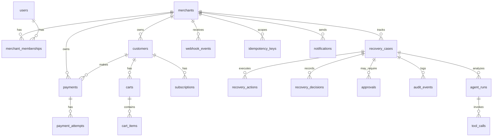

# RecoverAI database architecture (Phase 2)

PostgreSQL 16 is the source of truth for merchant data, payments, recovery cases, audit history, and idempotency records.

## ER diagram



## Table responsibilities

| Table | Purpose |
| --- | --- |
| `merchants`, `users`, `merchant_memberships` | Multi-tenant identity and RBAC membership |
| `customers` | Merchant-scoped customer profile and lifetime value |
| `payments`, `payment_attempts` | Payment lifecycle and retry attempts |
| `carts`, `cart_items` | Abandoned checkout context |
| `subscriptions` | Recurring billing failure context |
| `recovery_cases` | Core recovery workflow subject |
| `recovery_actions`, `recovery_decisions` | Executed/planned interventions and structured decisions. Phase 7 appends ERV rankings (`decision_version=erv-v1`) without overwriting history. |
| `policy_evaluations`, `approvals` | Guardrail outcomes and human approval queue |
| `webhook_events` | Inbound provider events (deduplicated) |
| `idempotency_keys` | Side-effect deduplication store |
| `audit_events`, `agent_runs`, `tool_calls` | Traceability without hidden chain-of-thought |
| `notifications` | Outbound communication records |
| `model_versions`, `model_predictions` | Trained recovery-probability metadata and scored case/action pairs (Phase 6) |

## Tenant boundaries

Every business record includes `merchant_id`. Repositories require `merchant_id` on reads and writes. Cross-merchant access is prevented at the query layer and should later be enforced at the API/auth layer in Phase 11.

## Money representation

- PostgreSQL: `NUMERIC(18,2)` for display amounts (`amount`, `amount_at_risk`, `amount_recovered`, cart totals, discounts, lifetime value)
- Application code: Python `Decimal` only — never `float`
- Provider minor units: optional `BIGINT` columns such as `provider_amount_minor`
- Currency: ISO-like 3-letter `VARCHAR(3)`, default `INR`
- Check constraints enforce non-negative amounts where required

## Open recovery case uniqueness

Partial unique indexes enforce at most one **open** recovery case per underlying subject:

- `(merchant_id, payment_id) WHERE payment_id IS NOT NULL AND closed_at IS NULL`
- `(merchant_id, cart_id) WHERE cart_id IS NOT NULL AND closed_at IS NULL`
- `(merchant_id, subscription_id) WHERE subscription_id IS NOT NULL AND closed_at IS NULL`

Closed cases (`closed_at` set) do not participate. This allows historical cases while preventing duplicate active work on the same payment/cart/subscription.

## Indexes (selected)

- `recovery_cases`: merchant + status, merchant + case_type, merchant + created_at; Phase 4 adds `last_mismatch_reason`, `verified_payment_id`, `verified_webhook_event_id`
- `payments`: merchant + customer, provider payment lookup unique constraint
- `approvals`: merchant + status (pending queue)
- `audit_events`: merchant + case timeline (`case_id`, `created_at`)
- `webhook_events`: unique `(provider, event_id)`

## Idempotency storage

`idempotency_keys` is unique on `(merchant_id, key)`. `recovery_actions` also enforce `(merchant_id, idempotency_key)` uniqueness. Phase 3 uses `webhook_events` uniqueness `(provider, event_id)` for inbound provider events; `idempotency_keys` remains available for later tool side effects.

## Audit storage

`audit_events` is append-only in usage. Structured summaries and metadata only — no hidden chain-of-thought. `agent_runs` and `tool_calls` store concise input/output summaries for later agent evaluation.

## Retention / deletion considerations

Phase 2 does not implement retention jobs. Future considerations:

- Webhook payloads may be large; consider payload truncation or cold storage after processing
- Audit events should be retained for compliance demos; production would tier by age
- Idempotency keys should expire via `expires_at` cleanup job in a later phase

## Migration

Initial revision: `20260903_0001`

```bash
uv run alembic upgrade head
uv run alembic downgrade base   # rollback entire Phase 2 schema
```

Schema is fully reproducible from Alembic migrations — do not rely on `create_all` in production.
